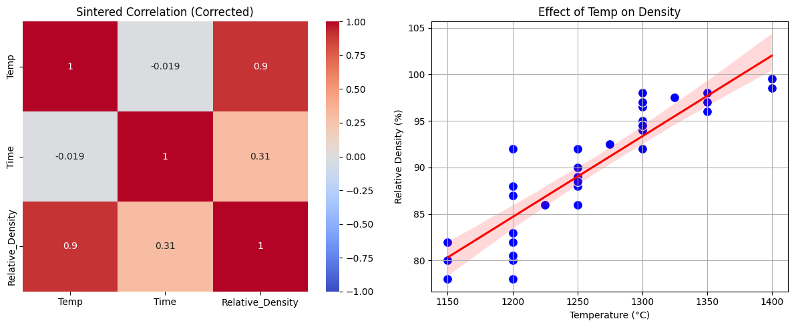
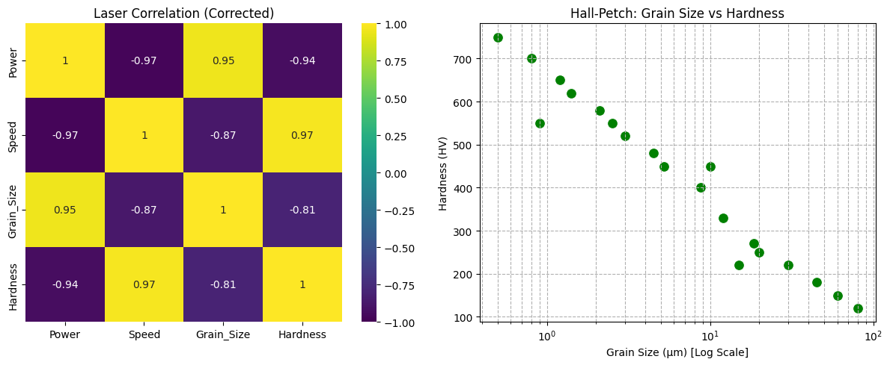
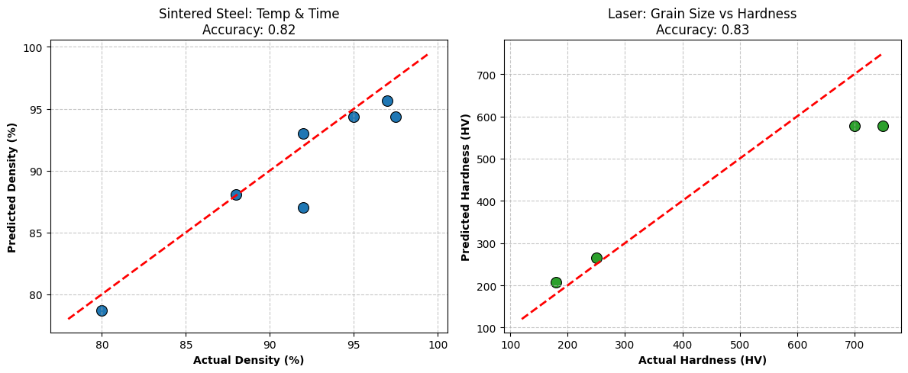

Data-Driven Prediction of Mechanical Properties in Alloys

Predicting Relative Density and Hardness in Sintered and Laser-Processed Alloys via Machine Learning.
📌 Project Overview

This project applies Machine Learning to optimize metal alloy manufacturing processes. By analyzing processing parameters like temperature, time, and laser scan speed, we predict critical mechanical outcomes, reducing the need for expensive trial-and-error experiments.
🛠️ Technical Stack

    Language: Python

    Libraries: Pandas, NumPy, Scikit-learn (Random Forest), Matplotlib, Seaborn

    Environment: Jupyter Notebook / Google Colab

📊 Key Results & Findings
1. Sintering Process Optimization

    Features: Sintering Temperature (∘C), Sintering Time (min).

    Target: Relative Density / Porosity.

    Performance: The Random Forest model achieved an R2 score of 0.82.

    Insight: Temperature was found to be the most significant factor affecting densification compared to holding time.

2. Laser Processing & Hardness

    Features: Laser Power (W), Scan Speed (mm/s), Grain Size (μm).

    Target: Vickers Hardness (HV).

    Performance: High predictive accuracy with an R2 score of 0.83.

    Metallurgical Verification: The model successfully captured the Hall-Petch Relationship, showing a strong negative correlation (r≈−0.81) between grain size and hardness.

📂 Repository Structure

    Final_Project.ipynb: Full data cleaning, EDA, and model training code.

    Minor Project REPORT.pdf: Comprehensive 50-page technical report detailing the study.

    data/: Contains sintering_core_dataset.csv and final_excel(1) - Laser(1)(1).csv.

🚀 How to Run

    Clone the repo: git clone https://github.com/mannrathod28/Alloy-Property-ML.git

    Install dependencies: pip install pandas scikit-learn matplotlib

    Open Final_Project.ipynb in Jupyter Notebook.

### Model Performance Visuals

